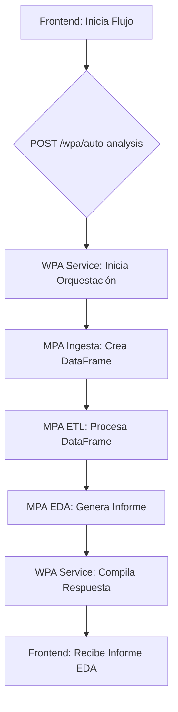

# Diagramas de Flujos de Trabajo (WPA)

Este documento visualiza los flujos de trabajo automatizados implementados en la arquitectura WPA.

## Flujo 1: Análisis Automático de Salud de Datos

Este flujo recibe una fuente de datos y una serie de pasos de ETL, y devuelve automáticamente un informe de análisis exploratorio de datos (EDA).

