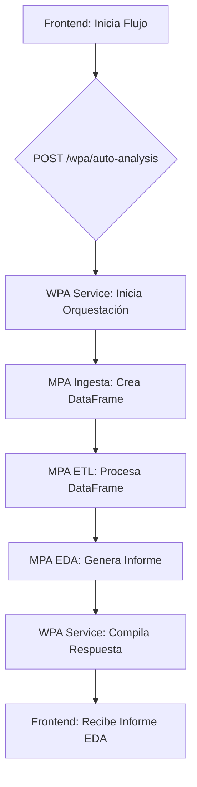
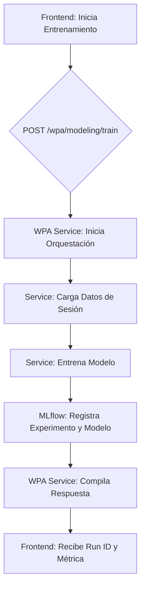
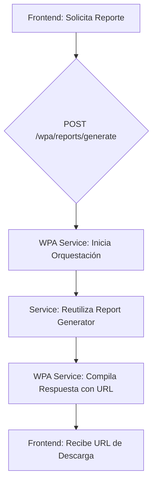
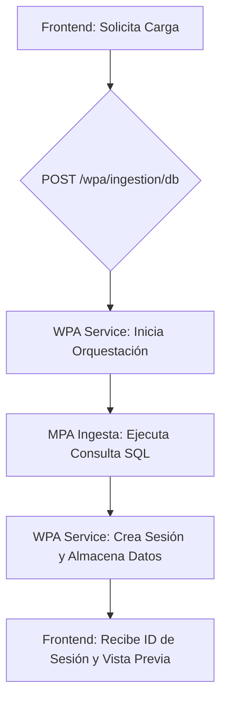

# Diagramas de Flujos de Trabajo (WPA)

Este documento visualiza los flujos de trabajo automatizados implementados en la arquitectura WPA.

## Flujo 1: Análisis Automático de Salud de Datos

Este flujo recibe una fuente de datos y una serie de pasos de ETL, y devuelve automáticamente un informe de análisis exploratorio de datos (EDA).

## Flujo 2: Entrenamiento de Modelos

Este flujo recibe una configuración de entrenamiento, entrena un modelo y lo registra en MLflow.

## Flujo 3: Generación de Reportes

Este flujo genera un reporte DOCX/PDF basado en los artefactos de una sesión.

## Flujo 4: Ingesta desde Base de Datos

Este flujo carga datos desde una base de datos y los almacena en una nueva sesión.

